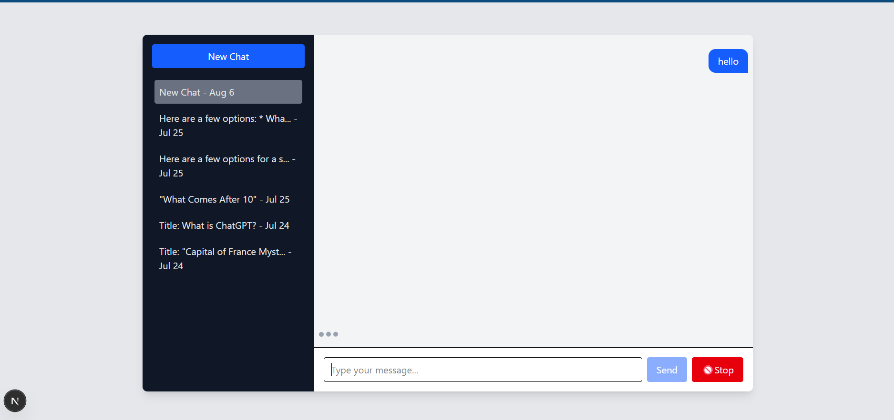
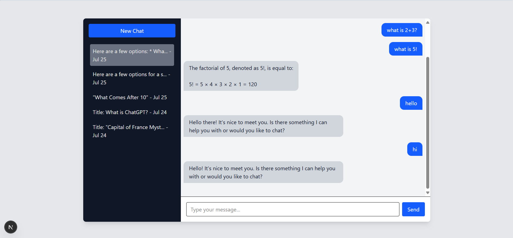

# 🧠 Local ChatGPT-style App using LLaMA 2 & Ollama

A local ChatGPT-style application powered by **LLaMA 2 (via Ollama)**, built with **Next.js**, **Node.js**, and **PostgreSQL**.



---

## 🔧 Tech Stack

| Layer     | Tech                  |
|-----------|------------------------|
| Frontend  | ✅ Next.js (React)     |
| Backend   | ✅ Node.js (Express)   |
| LLM       | ✅ Ollama (LLaMA 2)    |
| Database  | ✅ PostgreSQL          |

---

## 🚀 Features

### 🗨️ Chat Interface (Frontend)
- Minimal ChatGPT-style UI
- Input field with “Send” button
- Token-by-token streaming responses
- “Stop” button to abort generation
- Sidebar chat history with auto-generated titles

### 🔌 Backend API (Node.js + Express)
- `POST /api/chat` → Create new chat
- `POST /api/chat/:chatId/message` → Send message & receive streaming reply
- `POST /api/chat/:chatId/stop` → Abort ongoing generation
- `GET /api/chats` → List all chat sessions
- `GET /api/chat/:chatId` → Get message history

### 🗃️ Database Schema

Implemented using raw SQL (no ORM like Prisma).  
Tables are initialized manually via `server/src/sql.db`:

```sql
-- chats table
CREATE TABLE chats (
  id SERIAL PRIMARY KEY,
  title VARCHAR(255),
  created_at TIMESTAMP DEFAULT NOW()
);

-- messages table
CREATE TABLE messages (
  id SERIAL PRIMARY KEY,
  chat_id INTEGER REFERENCES chats(id) ON DELETE CASCADE,
  role VARCHAR(10), -- 'user' or 'assistant'
  content TEXT,
  timestamp TIMESTAMP DEFAULT NOW()
);
```

---

## 🛠️ Setup Instructions

### 📦 1. Install Ollama & LLaMA 2

```bash
# Download Ollama
https://ollama.com/download

# Pull the LLaMA 2 model
ollama pull llama2
```

### 🖥️ 2. Run the Model Server

```bash
ollama serve
```

> This exposes the LLM API at `http://localhost:11434/api/generate`

---

### 🧱 3. Backend Setup

```bash
cd server

# Install dependencies
npm install

# Copy and edit env file
cp .env.example .env
# (Edit .env with your PostgreSQL connection string)

# Initialize database
psql -U your_user -d your_db -f src/sql.db

# Start backend server
npm run dev
```

---

### 🎨 4. Frontend Setup

```bash
cd client

# Install frontend dependencies
npm install

# Start frontend dev server
npm run dev
```

---

## 🧪 Local Usage

1. Start Ollama model server:
   ```bash
   ollama run llama2
   ```

2. Start both backend and frontend.

3. Visit: [http://localhost:3000](http://localhost:3000)

Use the chat interface, stop responses, create new sessions, and browse past chats!

---
